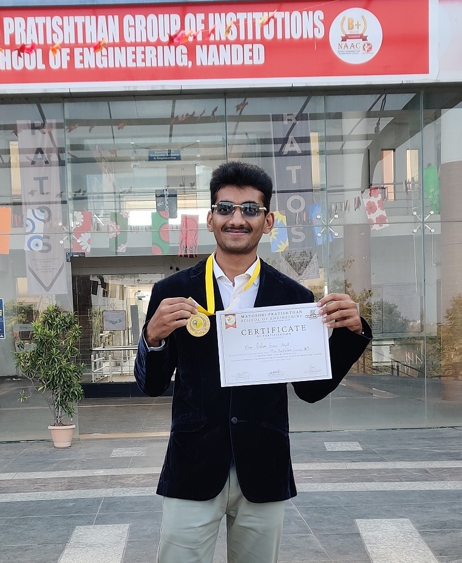

<div align="center">

  

  <h1>🚀 Gulamgous Khan — Portfolio</h1>

  <p>
    <strong>Full Stack AI/ML Engineer | Generative AI & Autonomous Agent Systems | MERN & Next.js Architecture</strong>
  </p>

  <p>
    <a href="https://github.com/Khangulamgousamjat"></a>
    <a href="https://linkedin.com/in/gulamgous"></a>
    <a href="https://leetcode.com/u/khangulamgous/"></a>
    <a href="https://stackoverflow.com/users/33063940/khan-gulamgous-amjat"></a>
    <a href="mailto:gousk2004@gmail.com"></a>
  </p>

  <p>
    
    
    
    
    
  </p>

  <p>
    <a href="#-overview">Overview</a> •
    <a href="#-key-features">Key Features</a> •
    <a href="#-featured-showcase-projects">Showcase Projects</a> •
    <a href="#-technical-stack">Tech Stack</a> •
    <a href="#-project-architecture">Project Structure</a> •
    <a href="#-getting-started">Getting Started</a> •
    <a href="#-environment-configuration">Environment Setup</a> •
    <a href="#-docker-deployment">Docker</a> •
    <a href="#-contact--connect">Connect</a>
  </p>

</div>

---

## 📌 Overview

Welcome to the official repository for **Gulamgous Khan's Personal Portfolio**. 

Built with the state-of-the-art **Next.js 16 (App Router)**, **React 19**, and **Tailwind CSS 4**, this portfolio is designed to showcase high-performance engineering, modern AI/ML systems, Generative AI agent workflows, and scalable full-stack web applications. 

### Key Highlights:
- **Ultra-Fast Server-Side Rendering (SSR)**: Powered by React Server Components (RSC) and Next.js 16 streaming.
- **Dynamic Content Hub**: Server-side sync with `dev.to` to pull, cache, and display live technical articles.
- **Dual Notification Gateway**: Seamless contact form dispatching to both **Gmail SMTP** and **Telegram Bot** alerts in real-time.
- **Modern Cyber Aesthetic**: Dynamic dark-mode UI with sleek glassmorphism, Lottie micro-animations, and continuous marquee skill sliders.

---

## 🌟 Key Features

| Feature | Description |
| :--- | :--- |
| **⚡ Next.js 16 & React 19** | Built on modern Next.js App Router architecture leveraging React 19 concurrent features and zero-JS static server rendering. |
| **🎨 Cyber Dark Glassmorphism UI** | Designed with Tailwind CSS 4, SCSS gradient overlays, and custom glowing borders for a futuristic developer experience. |
| **🤖 AI & Full Stack Project Showcase** | Dedicated interactive cards highlighting projects across Multi-Agent Systems, RAG, MERN stack, and Machine Learning models. |
| **🔄 Auto-Synced Technical Blog** | Real-time server-side Dev.to API integration that fetches, filters, and displays published engineering blogs without manual updates. |
| **📬 Dual-Channel Contact Notification** | Contact form submissions trigger instant notifications to both Gmail via Nodemailer and a private Telegram Bot. |
| **📊 Analytics & SEO Optimized** | Pre-configured with `@next/third-parties/google` (Google Tag Manager), open graph tags, and dynamic metadata. |
| **🐳 Containerized & Cloud Ready** | Includes development & production Docker configurations (`Dockerfile.dev`, `Dockerfile.prod`, `docker-compose.yml`). |
| **📱 100% Fully Responsive** | Pixel-perfect layout across mobile, tablet, laptop, and ultra-wide displays. |

---

## 🚀 Featured Showcase Projects

The portfolio highlights top-tier projects spanning Generative AI, Multi-Agent systems, distributed web apps, and machine learning pipelines:

| Project | Domain / Type | Key Technologies | Repository |
| :--- | :--- | :--- | :--- |
| **🤖 Pharma AI Agent** | Multi-Agent AI & Healthcare | Python, LangChain, AI Agents, RAG, OpenAI API | [View Code](https://github.com/Khangulamgousamjat/Pharma-AI-Agent) |
| **⚡ Event Gous Kratos** | Scalable Event Management Platform | TypeScript, Next.js, Node.js, PostgreSQL, Tailwind CSS | [View Code](https://github.com/Khangulamgousamjat/Event-Gous-Kratos) |
| **🛍️ Afreen Mall** | Full-Stack E-Commerce Solution | React, Node.js, Express, MongoDB, Tailwind CSS | [View Code](https://github.com/Khangulamgousamjat/Afreen-Mall) |
| **🎯 Skill Developer** | AI-Driven Developer Skill Tracker | JavaScript, GPT-4, OpenAI API, React, Node.js, Chart.js | [View Code](https://github.com/Khangulamgousamjat/Skill-Developer) |
| **🎓 Student Social** | Academic Real-Time Collaboration Hub | React, Node.js, MongoDB, Express, Socket.io | [View Code](https://github.com/Khangulamgousamjat/student-social-master) |
| **🩺 Multiple Disease Prediction** | Machine Learning Health Diagnostics | Python, Scikit-learn, NumPy, Pandas, Flask | [View Code](https://github.com/Khangulamgousamjat/Multiple-disease-Prediction) |
| **🌱 Food Waste Management** | Real-Time Surplus Food NGO Matching | TypeScript, React, Node.js, MongoDB, Tailwind CSS | [View Code](https://github.com/Khangulamgousamjat/food-waste-management) |

---

## 💻 Technical Stack

<div align="center">

| Category | Technologies & Tools |
| :--- | :--- |
| **Core Languages** | Python, JavaScript (ES6+), TypeScript, C, C++, HTML5, CSS3 |
| **Frontend Frameworks** | Next.js 16 (App Router), React 19, Tailwind CSS 4, SASS/SCSS |
| **AI / Machine Learning** | LangChain, AI Agents, RAG Pipelines, PyTorch, TensorFlow, Scikit-learn, OpenCV, NumPy, Pandas, OpenAI GPT-4 |
| **Backend & APIs** | Node.js, Express.js, FastAPI, Django, REST APIs, Socket.io, Server Actions |
| **Databases** | MongoDB, PostgreSQL, MySQL, Firebase Firestore |
| **DevOps & Cloud** | Docker, Kubernetes, AWS, GCP, Azure, Linux, Nginx, Git, GitHub Actions |
| **UI, Motion & Extras** | Lottie React, React Fast Marquee, React Icons, React Toastify, Sharp, Figma |

</div>

---

## 📁 Project Structure

```bash
Gous-khan-portfolio-3.0/
├── app/
│   ├── api/
│   │   ├── contact/          # Server API route for form submissions (Email + Telegram)
│   │   ├── data/             # Backend data handlers
│   │   └── google/           # Google Tag Manager and verification endpoints
│   ├── assets/               # Lottie animations, SVG graphics, icons
│   ├── blog/                 # Blog list and dynamic slug detail pages
│   ├── components/
│   │   ├── helper/           # Glow cards, animations, scroll-to-top utilities
│   │   ├── homepage/         # Hero, About, Experience, Skills, Projects, Education, Blog, Contact
│   │   ├── footer.jsx        # Responsive footer with social badges
│   │   └── navbar.jsx        # Sticky backdrop-blur navigation bar
│   ├── css/                  # Global SCSS, Tailwind config, card glow styles
│   ├── layout.js             # Root Next.js layout, font loader, GTM provider
│   ├── not-found.jsx         # Custom 404 page
│   └── page.js               # Homepage entry with server-side dev.to data fetching
├── public/                   # Static assets, profile image, project previews, SVGs
├── utils/
│   ├── data/                 # Centralized, customizable portfolio data modules
│   │   ├── personal-data.js  # Bio, social links, designation, contact info
│   │   ├── projects-data.js  # Project list, tools, roles, descriptions & URLs
│   │   ├── skills.js         # Technical skills data for marquee banner
│   │   ├── experience.js     # Professional and open-source experience
│   │   ├── educations.js     # Degrees, academic background, certifications
│   │   └── contactsData.js   # Contact form configuration
│   ├── check-email.js        # Email validation helper
│   ├── skill-image.js        # Dynamic skill icon resolver
│   └── time-converter.js     # Timestamp formatting utility
├── Dockerfile.dev            # Development container configuration
├── Dockerfile.prod           # Multi-stage optimized production Dockerfile
├── docker-compose.yml        # Docker compose service definition
├── package.json              # Project dependencies & scripts
└── README.md                 # Project documentation
```

---

## 🛠️ Getting Started

### Prerequisites

Ensure you have the following installed on your machine:
- **Node.js**: `v18.17.0+` (Node.js 20+ LTS recommended)
- **Package Manager**: `pnpm` (recommended), `npm`, or `yarn`
- **Git**: Latest version

```bash
# Verify versions
node --version
pnpm --version # or npm --version
git --version
```

### 1. Clone the Repository

```bash
git clone https://github.com/Khangulamgousamjat/Gous-khan-portfolio-3.0.git
cd Gous-khan-portfolio-3.0
```

### 2. Install Dependencies

```bash
# Using pnpm (Recommended)
pnpm install

# Or using npm
npm install

# Or using yarn
yarn install
```

### 3. Configure Environment Variables

Copy the example environment file and fill in your values:

```bash
cp .env.example .env
```

### 4. Run Development Server

```bash
pnpm dev
# or
npm run dev
# or
yarn dev
```

Open [http://localhost:3000](http://localhost:3000) in your browser to see the portfolio live.

---

## ⚙️ Environment Configuration

Create a `.env` file in the root directory:

```env
# Application Base URL
NEXT_PUBLIC_APP_URL=http://localhost:3000

# Google Tag Manager (Optional)
NEXT_PUBLIC_GTM=GTM-XXXXXXX

# Gmail SMTP Credentials (For contact form email alerts)
EMAIL_ADDRESS=your-email@gmail.com
GMAIL_PASSKEY=your_16_character_app_password

# Telegram Bot Credentials (For instant mobile message notifications)
TELEGRAM_BOT_TOKEN=123456789:ABCdefGHIjklMNOpqrsTUVwxyz
TELEGRAM_CHAT_ID=123456789
```

### Setting up Integrations:

<details>
<summary><strong>📧 Gmail App Password Setup (Nodemailer)</strong></summary>

1. Visit your [Google Account Security Settings](https://myaccount.google.com/security).
2. Ensure **2-Step Verification** is turned ON.
3. Under *2-Step Verification*, scroll to **App passwords**.
4. Create a new app password (e.g., name it `Portfolio`).
5. Copy the generated 16-character code into `GMAIL_PASSKEY` and your email address into `EMAIL_ADDRESS`.
</details>

<details>
<summary><strong>🤖 Telegram Bot Notification Setup</strong></summary>

1. Open Telegram and search for [`@BotFather`](https://t.me/BotFather).
2. Send `/newbot` and follow the prompt to name your bot.
3. Copy the HTTP API token into `TELEGRAM_BOT_TOKEN`.
4. Open a chat with your newly created bot and send a message (e.g. `Hello`).
5. Find your Chat ID by browsing to `https://api.telegram.org/bot<YOUR_BOT_TOKEN>/getUpdates`.
6. Copy the `id` from the `chat` object and paste it into `TELEGRAM_CHAT_ID`.
</details>

<details>
<summary><strong>📝 dev.to Blog Dynamic Sync</strong></summary>

1. Open `utils/data/personal-data.js`.
2. Ensure your `devUsername` is configured:
   ```javascript
   export const personalData = {
     // ...
     devUsername: "Khangulamgousamjat",
   };
   ```
3. Articles published under this username on [dev.to](https://dev.to) will automatically be fetched, randomized, and rendered in the Blog section.
</details>

---

## 🐳 Docker Deployment

You can run this portfolio in a fully containerized environment without installing Node.js locally.

### Using Docker Compose (Quickest)

```bash
# Build and run the container in detached mode
docker compose up -d --build

# View logs
docker compose logs -f

# Stop container
docker compose down
```

### Using Multi-Stage Production Dockerfile Directly

```bash
# 1. Build production image
docker build -t gous-portfolio:prod -f Dockerfile.prod .

# 2. Run container on port 3000
docker run -d -p 3000:3000 --name portfolio-prod --env-file .env gous-portfolio:prod
```

---

## 🚢 Production Deployment

### Deploying to Vercel (Zero-Config)
1. Push your repository to GitHub (`Khangulamgousamjat/Gous-khan-portfolio-3.0`).
2. Import the repository on [Vercel](https://vercel.com).
3. Add your environment variables in the project settings.
4. Click **Deploy**. Vercel handles Next.js 16 SSR, edge caching, and automated builds seamlessly.

### Deploying to Netlify / VPS
- Build command: `pnpm build` (or `npm run build`)
- Start command: `pnpm start` (or `npm start`)
- Node.js version: `20.x` or higher

---

## 🤝 Connect & Contact

Feel free to reach out for collaborations, AI/ML consulting, software engineering roles, or open-source discussions:

<div align="center">

| Channel | Link |
| :--- | :--- |
| 👨‍💻 **GitHub** | [@Khangulamgousamjat](https://github.com/Khangulamgousamjat) |
| 💼 **LinkedIn** | [linkedin.com/in/gulamgous](https://linkedin.com/in/gulamgous) |
| 🧩 **LeetCode** | [leetcode.com/u/khangulamgous](https://leetcode.com/u/khangulamgous/) |
| 💬 **Stack Overflow** | [Khan Gulamgous Amjat](https://stackoverflow.com/users/33063940/khan-gulamgous-amjat) |
| ✍️ **Dev.to** | [dev.to/khangulamgousamjat](https://dev.to/Khangulamgousamjat) |
| 📧 **Email** | [gousk2004@gmail.com](mailto:gousk2004@gmail.com) |
| 📱 **Phone** | [+91 8625076618](tel:+918625076618) |

</div>

---

## 📄 License

This project is licensed under the **MIT License** — see the [LICENSE](LICENSE) file for details.

<div align="center">
  <sub>Built with ❤️ by <a href="https://github.com/Khangulamgousamjat">Gulamgous Khan</a> • © 2026 All Rights Reserved</sub>
</div>
